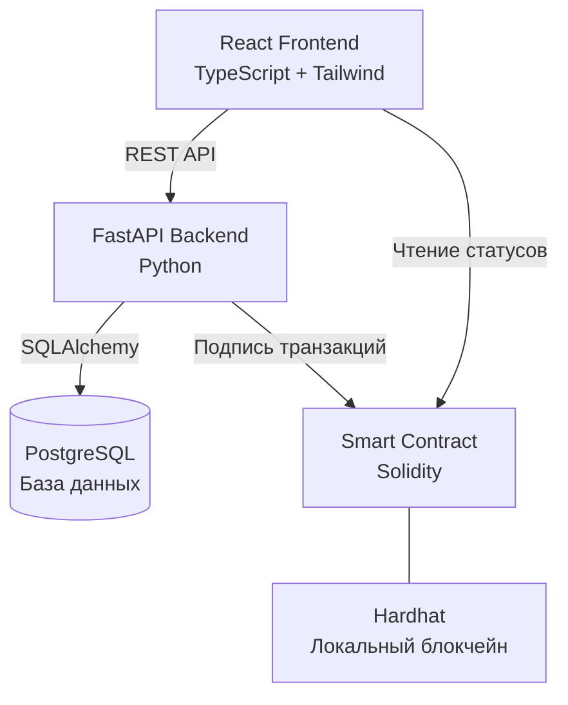
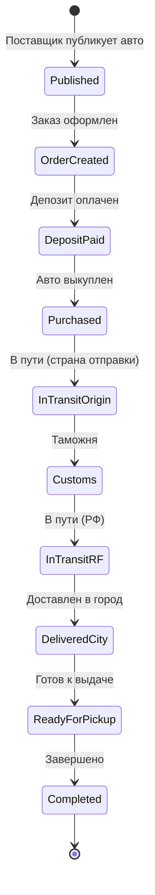
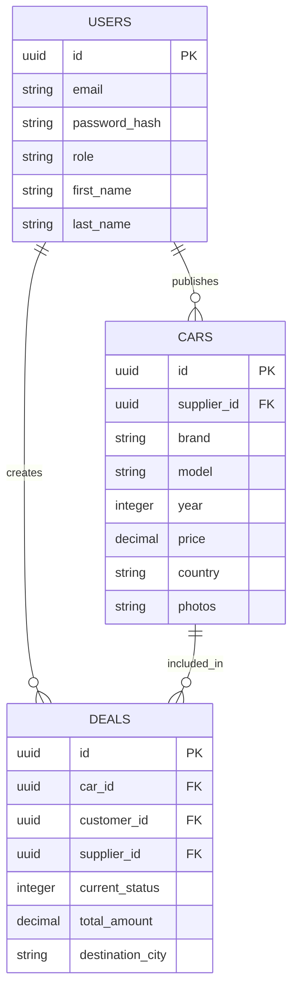
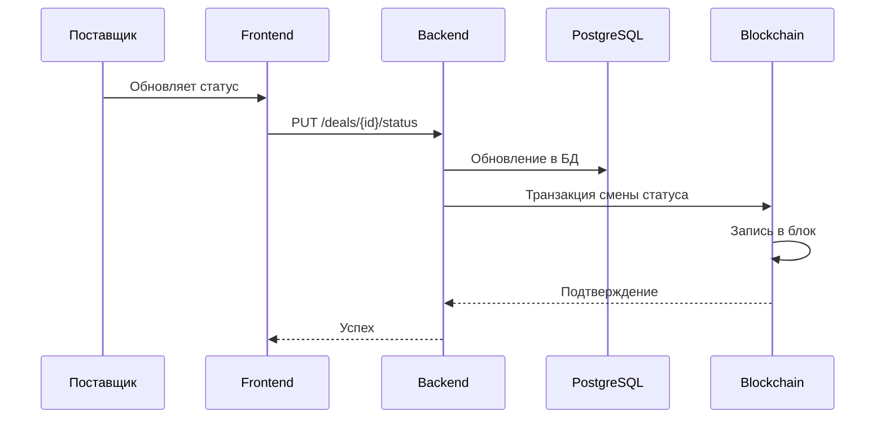

# Архитектура
## 1. Общая архитектура

**Описание:**
- Frontend обращается к Backend через REST API
- Frontend читает статусы напрямую из блокчейна через viem
- Backend хранит данные в PostgreSQL
- Backend подписывает транзакции смены статуса сервисным кошельком

---

## 2. Жизненный цикл сделки

**Статусы в блокчейне:** 0-9

---

## 3. Структура базы данных

---

## 4. Смена статуса сделки

