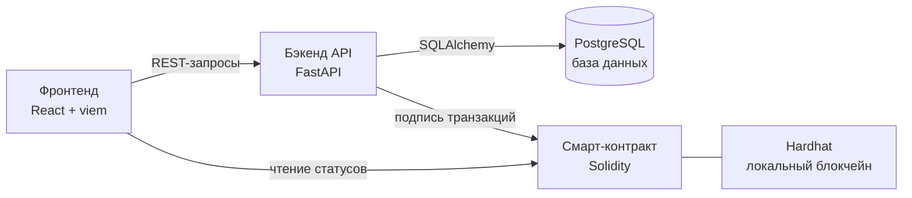

# CarLeon - платформа перевозки автомобилей из-за рубежа

Веб-платформа, которая соединяет поставщиков автомобилей из других стран
с заказчиками из России и обеспечивает прозрачное отслеживание сделки
на всех этапах - от выбора авто до передачи ключей

---

##  О проекте

Платформа решает две задачи:

1. **Для поставщика** - публикация предложений: из какой страны,
   какой автомобиль, по какой цене и на каких условиях возможна перевозка
2. **Для заказчика** - выбор автомобиля, оплата и отслеживание полного
   жизненного цикла сделки через систему статусов

---

## Цели и задачи

- Реализовать полный цикл сделки: от публикации авто до его получения.
- Обеспечить прозрачное отслеживание статусов на каждом этапе.


---

## Роли пользователей

| Роль         | Возможности                                                                 |
|--------------|------------------------------------------------------------------------------|
| **Поставщик** | Регистрация, публикация авто (страна, марка, модель, цена, фото), обновление статусов перевозки |
| **Заказчик**  | Просмотр каталога, оформление заказа, оплата, отслеживание статусов           |
| **Админ**     | Модерация объявлений, управление пользователями, разрешение спорных ситуаций |

---

## Жизненный цикл сделки (статусы)

```
Опубликовано → Заказ оформлен → Оплачен депозит → Выкуплен у продавца
→ В пути (страна отправки) → Таможня → В пути (РФ) → Доставлен в город
→ Готов к выдаче → Завершено
```

---

## Блокчейн
- В контракте хранится только история статусов
- Оплата и персональные данные в блокчейн не попадают - они в PostgreSQL
- Смена статуса подписывается сервисным кошельком бэкенда
- Историю статусов нельзя подделать задним числом
---

## Тех. стек

- Frontend:  React + TypeScript + Tailwind + viem
- Backend:   FastAPI + PostgreSQL + SQLAlchemy
- Контракт:  Solidity + Hardhat (локальный блокчейн)
- Связь:     backend подписывает tx сервисным кошельком
- Инфра:     Docker + docker-compose
---

## Архитектура


- Frontend читает статусы из контракта напрямую через viem, остальное - через API
- Backend подписывает транзакции смены статуса сервисным кошельком
- В блокчейне - только статусы сделки, персональные данные и оплата - в PostgreSQL
---

## Ветвление и правила работы с Git

Мы используем **Git Flow**:

- `main` - стабильная версия, только через Pull Request
- `develop` - основная ветка разработки
- `feature/<название>` - новая функциональность
- `fix/<название>` - исправления

**Правила:**
1. Одна задача = одна ветка
2. Осмысленные коммиты: `feat:`, `fix:`, `docs:`, `refactor:`
3. Перед пушем - проверка кода и тесты

---

## Структура репозитория

```
.
├── contracts/          # Solidity + Hardhat
│   ├── contracts/      # .sol файлы
│   ├── scripts/        # скрипты деплоя
│   └── test/           # тесты контракта
├── backend/            # FastAPI бэкенд
│   ├── app/
│   │   ├── api/        # API роуты
│   │   ├── core/       # Основная конфигурация
│   │   ├── models/     # SQLAlchemy ORM модели
│   │   ├── schemas/    # Pydantic схемы
│   │   ├── services/   # Слой бизнес-логики
│   │   └── db/         # Управление сессиями БД
│   └── tests/          # Тесты бэкенда
├── frontend/           # React фронтенд
│   ├── src/
│   │   ├── components/ # Переиспользуемые UI компоненты
│   │   ├── pages/      # Компоненты страниц
│   │   ├── hooks/      # Custom React hooks
│   │   ├── services/   # API вызовы
│   │   ├── utils/      # Утилитные функции
│   │   ├── context/    # React context провайдеры
│   │   └── types/      # TypeScript типы
│   └── public/         # Статические файлы
├── docker-compose.yml
└── README.md           # Документация проекта
```

---

## Команда

| Участник | Роль | Ответственность |
|----------|------|------------------|
| Максим | Аналитик | анализ требований, документация |
| Амир | Тех писатель | техническая документация |
| Артём | Тех писатель | техническая документация |
| Саша | Скрам/Тех писатель | координация, документация |

---

## Документация

- [Структура проекта](structure.md)
- [Архитектура](architecture.md)
- [Формат данных](data_format.md)
- [Аналитика](analytics.md)
